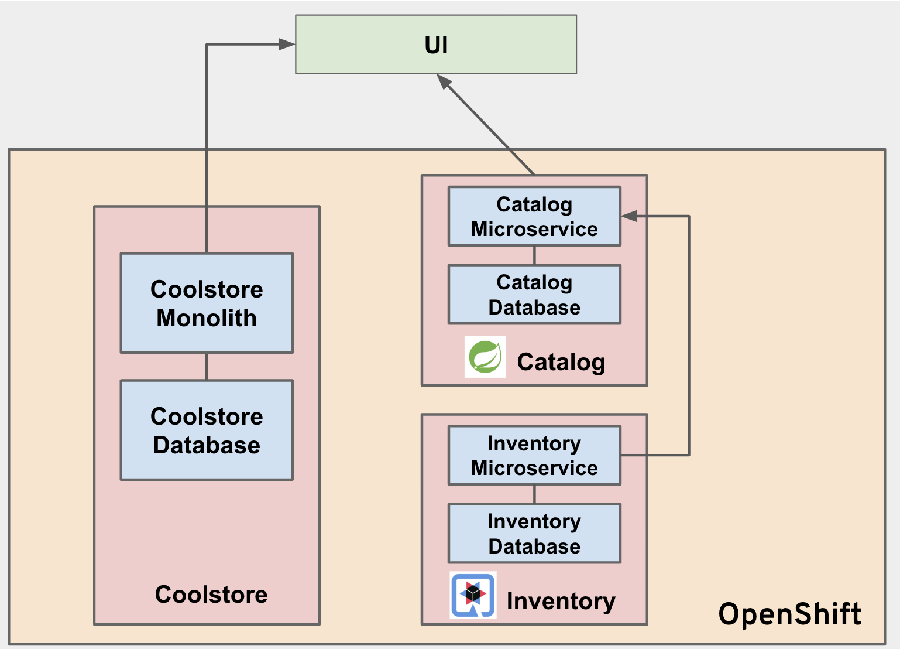

We will deploy a monolith application "CoolStore"

```shell
oc new-project cn-hybrid
./1-build-deploy-monolith.sh
./2-build-deploy-inventory.
./3-build-deploy-catalog.sh
```
  Replace the catalog service route



```shell
WWW_ROUTE=$(oc get route www -o jsonpath='{.spec.host}')
oc create route edge www-catalog --service=catalog --port='8080' --hostname=$WWW_ROUTE --path=/services/products
oc patch route www-catalog --type json  --patch '[{ "op": "remove", "path": "/spec/tls" }]'
```
